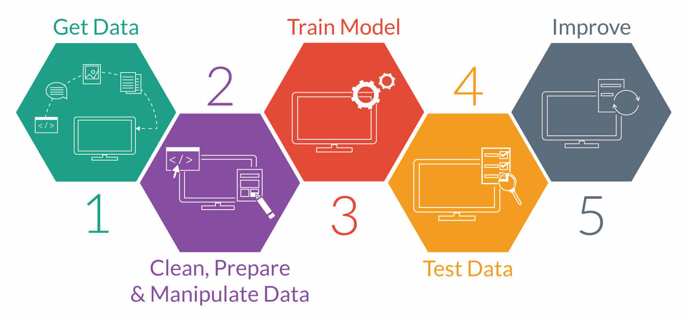

# Introduction to Machine Learning

_Notes of the free Machine Learning course from Pluralsight, found_
_[here](https://www.pluralsight.com/courses/python-understanding-machine-learning)._

To see the python scripts, first you need to have intalled _Python 3_ and _pip_.

Then, you have to install _Jupyter_ and then run the _Jupyter notebook_:

```
pip install jupyter
jupyter notebook
```

## Definition
*Machine learning*: Building a model from example inputs to make data-driven predictions vs. following strictly static program instructions.


## Machine learning logic

Instead of "if", "case", "while" and "until", uses the data parsed to a format we can use, then we pass this formatted data to an algorithm that analyses the data (data analysis) and then it creates a model that implements the solution to solve the problem based on the data.


## Ways machines learn from data

- **Supervised:**
    Data is labeled and has features, and we know the result we want to obtain for that data.

- **Unsupervised:**
    Search clusters of blank data and encounters groups of data that share the same traits.


|**Supervised**|**Unsupervised**|
|---|---|
|Value prediction|Identify clusters of like data|
|Needs training data containing value being predicted|Data does not contain cluster membership|
|Trained model predicts value in new data|Model probides access to data by cluster|


## Machine Learning Workflow

An **orchestrated and repeatable** pattern which systematically **transform and processes information** to **create prediction solutions**.

1. Ask the right question
2. Preparing data
3. Selecting the algorithm
4. Training the model
5. Testing the model --> If something went wrong, iterate from (2)



### Guidelines for machine learning workflow
- **Early steps are most important**. Each step depends on previous steps
- **Expect to go backwards**. Later knowledge effects previous steps
- **Data is never as you need it**. Data will have to be altered.
- **More data is better**. More data => better results.
- **Don't pursue a bad solution**. Reevaluate, fix or quit.


## Asking the right question
Define end goal, starting point and how to achieve goal.
```
Predict if a person will develop diabetes
```
This sentence can be improved.


### Solution statements goals:
1. Define scope (including data sources)
2. Define target performance
3. Define context for usage
4. Define how solution will be created

Detailed:

1. Scope and data sources:
    - Understand the features in data
    - Identify critical features
    - Focus on at risk population
    - Select data source -> Pimia indian diabetes study is a good source

```
Using Pima Indian Diabetes data, predict which people will develop diabetes.
```
2. Performance targets:
    - Binary result (True or False)
    - We want more accurancy than just a coin flip (>50%)
    - Genetic difference are a factor
    - 70% accurancy is common target.
```
Using Pima Indian Diabetes data, predict with 70% or great accuracy, which people will develop diabetes.
```

3. Context
    - Disease prediction
    - Medical research practices
    - Unknown variations between people
    - Likelihood is used
```
Using Pima Indian Diabetes data, predict with 70% or great accuracy, which people are likely to develop diabetes.
```

4. Solution creation
    - Usually we will use the **Machine Learning Workflow** to develop the solution.
        - Process Pima Indian Data.
        - Transform data as required.
        - 

```
Using the Machine Learning Workflow to process and transform Pima Indian Diabetes data to create a prediction model. This model must predict which people are likely to develop diabetes with 70% or great accuracy.
```

## Preparing data

Find data we need
Inspect and clean data
Explore data and modify if necessary
Mold the data to tidy data

### Tidy data

Tidy datasets area easy to manipulate, model and visualize, and have a specific structure:
- Each **variable** is a **column**
- Each **observation** is a **row**
- Each type of **observational unit** is a **table**

`` 50-80% of a ML project is spent getting, cleaning, and organizing data. ``

### Getting data

Where to get it:
- Google
- Government databases
- Professional or company data sources
- Your company
- All of the above

**`Data Rule #1`**`: Closer the data is to what you are predicting, the better.`

**`Data Rule #2`**`: Data will never be in the format you need.`